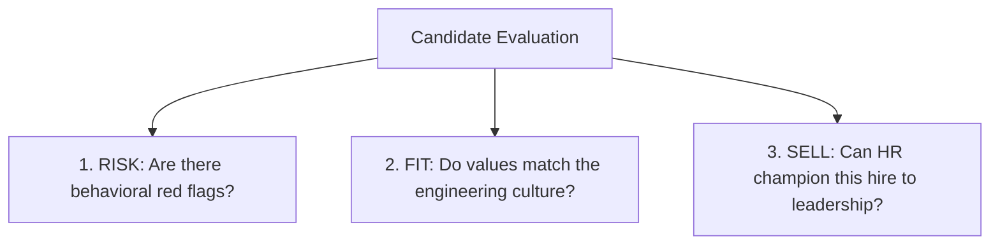
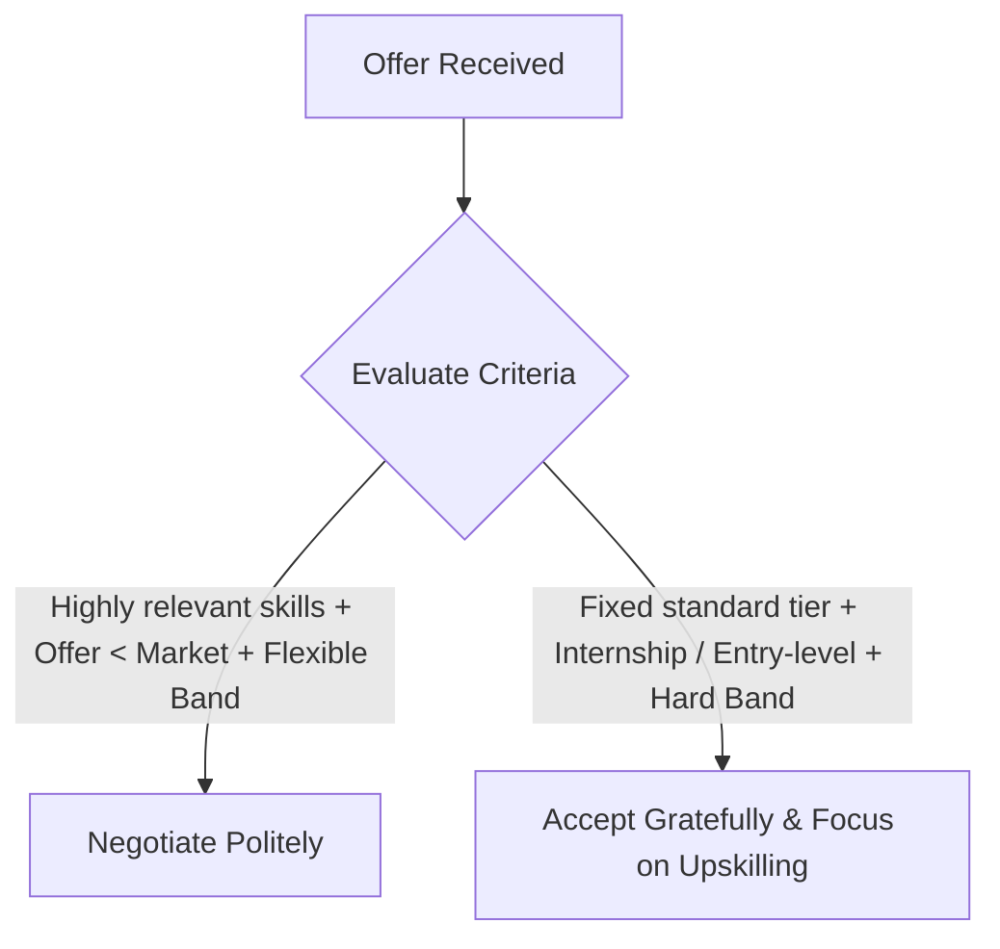

# Executive HR Mastery, Salary Negotiation & LinkedIn Career Playbook

A structured, first-principles synthesis of the **Final HR Round Framework**, **Salary Discussions & Offers**, **Interview Etiquette**, and **Corporate Soft-Skills & Networking Strategy**, combined with ready-to-publish **LinkedIn Thought-Leadership Posts**.

---

## 🏛️ PART 1: The HR Decision Framework (The "Risk, Fit, Sell" Model)

In technical rounds, engineers evaluate *what you can do* (syntax, data structures, model loss, latency). In the final HR round, leaders evaluate *who you are* (judgment, emotional maturity, long-term alignment, and brand safety).

### 1. The Core Mindset Shift
| Dimension | Technical Interviewers | HR / Executive Panel |
| :--- | :--- | :--- |
| **Primary Lens** | Hard skills, problem-solving speed, technical correctness | Long-term team cohesion, values, relationship-building |
| **Evaluation Horizon** | Short-term task execution | Multi-year retention and cultural impact |
| **Listening Method** | Literal (Do your algorithms work?) | Layered (Pattern-matching your career narrative and motives) |

### 2. The "Risk, Fit, Sell" Triad
Every hiring decision in the final round is filtered through three subconscious questions:

1. **Risk Filter**: Does the candidate badmouth former managers? Are there unexplained timeline gaps? Do they sound arrogant, defensive, or transactional?
2. **Fit Filter**: How do they handle ambiguity, sprint pressure, and constructive technical critique?
3. **Sell Factor**: Can HR walk into the VP/Director's office and say with 100% confidence: *"This person will elevate our team dynamic and represent our company well."*

### 3. The 5 Dimensions of Culture Fit
- **Collaboration & Team Orientation**: Prioritizing collective sprint outcomes over individual ego.
- **Adaptability & Growth Mindset**: Viewing system refactors and unexpected feedback as opportunities to iterate.
- **Communication & Emotional Intelligence**: Being clear, active in listening, concise, and empathetic under pressure.
- **Motivation & Long-Term Alignment**: Possessing intrinsic curiosity in the company's domain, not purely extrinsic compensation chasing.
- **Ownership & Accountability**: Owning production bugs and mispredictions without shifting blame to teammates.

### 4. Top 10 Fatal Deal-Breakers to Eliminate
1. Badmouthing past companies, mentors, or colleagues.
2. Inconsistent timeline dates between resume, LinkedIn, and verbal answers.
3. Demonstrating compensation-only motivation.
4. Lack of self-awareness (inability to discuss a genuine, real technical or operational weakness).
5. Entitlement, know-it-all attitude, or intellectual arrogance.
6. Giving vague, generic answers instead of concrete, metric-backed STAR examples.
7. Over-sharing unnecessary personal or financial circumstances.
8. Showing total disinterest or zero research into the company's business model.
9. Answering *"No, I have no questions"* at the end of the round.
10. Misrepresenting compensation, notice period, or concurrent offers.

---

## 💼 PART 2: Salary Discussions & Offer Negotiation Architecture

Reaching the compensation discussion means **they have already selected you**. You have maximum leverage, but that leverage must be exercised with collaborative professionalism rather than confrontation.

### 1. The Anatomy of Total Compensation (CTC)
$$\text{Total Rewards} = \text{Fixed Base} + \text{Variable Performance Pay} + \text{Benefits \& Retention Bonuses}$$
- **Fixed Pay**: Guaranteed monthly cashflow (Basic, HRA, Special Allowances).
- **Variable Pay**: Tied to milestones, KPIs, and company profitability.
- **Perks & Long-Term Assets**: Health insurance, PF/gratuity, ESOPs/RSUs, remote flexibility, and joining bonuses.

### 2. The Negotiation Decision Matrix


### 3. Exact Scripts & Templates

#### Script A: When Discussing Expectations (Initial Stage)
> *"Based on my specialized capabilities in data systems, the role’s architectural responsibilities, and current market standards for this engineering tier, I am expecting a fair and competitive package. I am completely open to discussion and happy to align with the company’s internal salary structure."*

#### Script B: The Polite Counter-Offer (Post-Offer Stage)
> *"Thank you very much for extending this offer. I am genuinely excited about the team's roadmap and the engineering challenges we discussed. Based on the scope of responsibilities, my hands-on experience delivering end-to-end ML systems, and prevailing market benchmarks, I was hoping to see if there is any flexibility for a slight revision in the fixed base component. I would love to make this an easy decision and get started."*

#### Script C: Formal Offer Acceptance
> *"Thank you for offering me the [Job Title] role. I am delighted to accept the offer and look forward to joining the team on [Date]. Please let me know the next steps regarding documentation and onboarding."*

#### Script D: Professional Offer Decline (Leaving Doors Open)
> *"Thank you sincerely for your time and for extending the offer for the [Job Title] role. After careful consideration, I have decided to accept another opportunity that aligns more closely with my specialized career trajectory at this moment. I have immense respect for the team and hope our paths cross again in the future."*

---

## 🎯 PART 3: Executive Interview Etiquette & STAR Execution

### 1. The 60-Second Behavioral Intro (The "Hook-Journey-Value" Framework)
- **Seconds 0–15 (The Hook)**: Name + Core Identity + Engineering Analytical Foundation.
- **Seconds 15–40 (The Journey)**: Transition into data systems, core technical moats (physics-grounded spatial models, sequence forecasting, multi-agent RAG).
- **Seconds 40–60 (The Value Alignment)**: Why this exact company, and how your systems-first mindset solves their operational bottlenecks.

### 2. The STAR Behavioral Answering Structure
Every behavioral answer must follow this four-part progression:
- **S (Situation)**: Set the context in 2 sentences. Include constraints (tight compute budget, legacy schemas, strict deadlines).
- **T (Task)**: The specific objective you owned.
- **A (Action)**: The concrete technical and interpersonal decisions you made (algorithms selected, cross-functional collaboration, unit testing).
- **R (Result)**: The quantified outcome (**X**, measured by **Y**, doing **Z**), plus the long-term impact on the team.

### 3. High-Impact Questions to Ask HR at the End
Never leave an interview without asking 2–3 strategic questions:
1. *"What distinguishes the top 5% of engineers who thrive in this culture from those who struggle?"*
2. *"How does the engineering leadership support continuous upskilling and architectural ownership among junior and mid-level engineers?"*
3. *"Looking back a year from now, what would success look like for someone stepping into this role?"*

---

## 📱 PART 4: Ready-to-Post LinkedIn Thought Leadership Series

*Copy and publish these high-engagement posts directly on your LinkedIn profile.*

### 🚀 Post 1: The "80% Rule" & Why Great Code Fails the Final Round
**Category:** Thought Leadership / Engineering Career Strategy

```markdown
Most engineers spend 95% of their energy obsessing over syntax, model loss, and LeetCode.

Then they walk into the Final HR Round and wonder why they didn't get the offer.

Here’s an uncomfortable truth:
Your technical rounds prove WHAT you can do.
The final round determines WHO you are.

Research shows that nearly 80% of long-term career success is governed by interpersonal judgment, emotional intelligence, and structural communication—not just raw compute power.

When an HR Director or VP evaluates you in the final round, they are silently running a 3-part mental filter:

1. THE RISK FILTER
Are there timeline inconsistencies? Does this candidate blame former managers when things go wrong? Will they be toxic when a sprint slips?

2. THE FIT FILTER
How do they communicate under ambiguity? Can they translate complex ML metrics into plain business P&L? Do they understand our company's economic engine?

3. THE SELL FILTER
Can HR walk into the Hiring Manager's office with 100% conviction and say: "This person will elevate the entire team dynamic"?

Code gets you through the door.
Judgment, ownership, and emotional maturity get you the offer.

To anyone preparing for final rounds this quarter:
Stop memorizing generic answers. Practice self-awareness, know your real weaknesses, and treat every salary and role discussion as a collaborative partnership—not a confrontation.

What’s the most important soft skill you look for when hiring engineers? 👇

#SoftwareEngineering #DataScience #CareerGrowth #Leadership #Hiring #Interviews
```

---

### 💡 Post 2: The First-Principles Guide to Salary Discussions
**Category:** Career Tactics / Offer Negotiation

```markdown
The biggest mistake engineers make during offer discussions?
Treating salary negotiation like an adversarial battle.

Here is the mindset shift that changed how I view compensation:

Reaching the salary discussion doesn't mean you need to fight for your worth. It means the company has already selected you. They WANT you on board.

Here is a 4-step framework for navigating offer discussions with zero awkwardness:

1. UNDERSTAND THE FULL REWARDS ARCHITECTURE
Never fixate solely on the CTC number. Evaluate the breakdown:
• Fixed Base (your guaranteed monthly cashflow)
• Variable / Performance Pay (measurable milestone payouts)
• Long-term upside (ESOPs, RSUs, retention bonuses, learning stipends)

2. GROUND EXPECTATIONS IN MARKET DATA, NOT EXPENSES
Never justify a counter-offer with personal financial obligations (rent, loans, personal goals).
Companies budget for capability and impact, not personal overhead. Ground every expectation in role scope and verified market benchmarks.

3. KNOW WHEN TO NEGOTIATE (AND WHEN TO HOLD)
• Negotiate when: You bring rare specialized skills, the offer is demonstrably below market tier, or leadership indicates band flexibility.
• Hold when: You're entering a structured fixed-bracket graduate program or fixed internship tier where bands are non-negotiable.

4. COLLABORATIVE LANGUAGE WINS EVERY TIME
Swap demand statements with partnership statements:
❌ "My expectation is higher than this offer."
✅ "I'm genuinely excited about this team's roadmap. Based on the responsibilities discussed and prevailing market benchmarks, is there any flexibility for a slight revision in the fixed base?"

Professionalism builds long-term reputation. Reputation is worth more than any single signing bonus.

#CareerAdvice #Negotiation #TechCareers #Compensation #JobOffers
```

---

### 🌱 Post 3: Rejection Is Data, Not Defeat
**Category:** Professional Resilience / Growth Mindset

```markdown
Every engineer remembers the sting of their first dream-job rejection.

Your brain processes professional rejection as a psychological threat. It’s easy to spiral into self-doubt: "My code wasn't good enough," or "I failed."

Over the past year of building systems and interviewing, I adopted a strict First-Principles reframe:

Rejection is rarely an indictment of your capability. Most of the time, it is simply a boundary mismatch in "fit."

When you get a "No", run this 5-step feedback protocol:

1. Listen Actively: Separate emotional disappointment from the factual feedback.
2. Clarify: Politely ask for 1-2 specific architectural or communication areas to improve.
3. Reflect: Were your answers too vague? Did you rush your STAR storytelling?
4. Plan: Convert the gap into an immediate technical or behavioral sprint.
5. Act: Update your systems, ship another module, and keep moving.

And most importantly:
Never ghost an interviewer or HR partner after a rejection. Send a 2-line note expressing gratitude and wishing the team well.

The tech world is remarkably small. That same HR partner or hiring manager might have the perfect principal role open 6 months from now—and they will remember how you handled the "No."

Treat every rejection as an unpaid practice round for the offer you were meant to accept.

#Mindset #Resilience #TechCommunity #GrowthMindset #JobSearch
```
